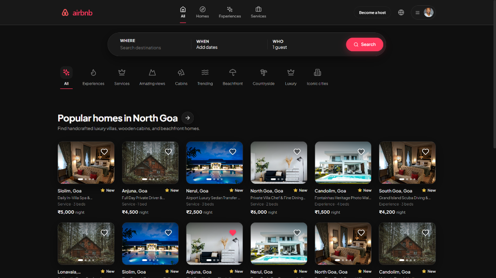
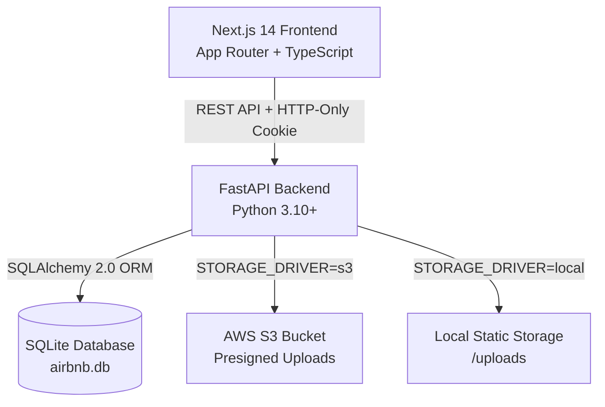
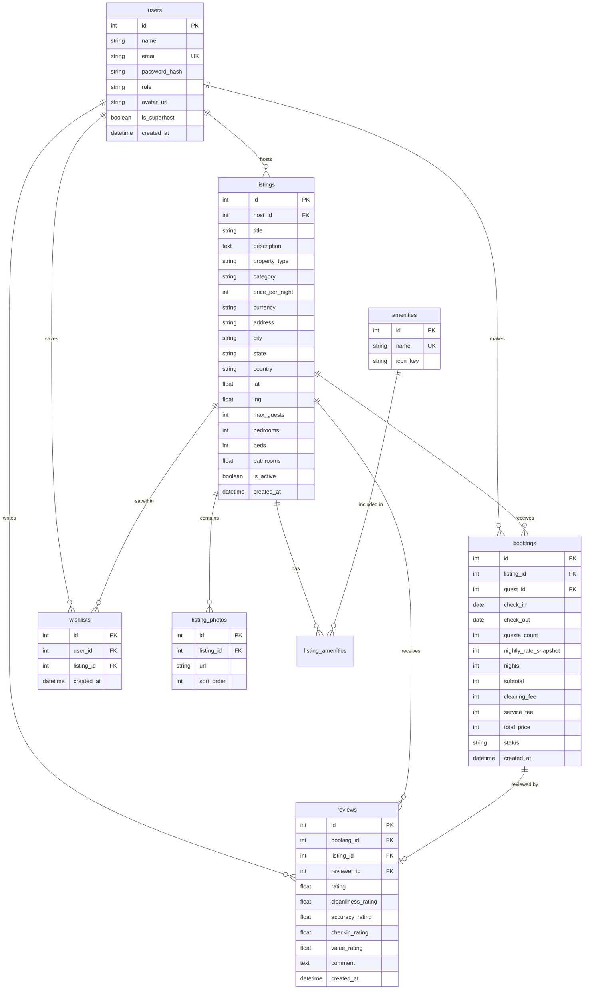

# Airbnb Clone (Dark Mode) — Full-Stack Build

A production-quality, responsive clone of Airbnb themed in a custom, warm dark mode palette. Built with a **Next.js 14 (App Router)** TypeScript frontend and a **Python FastAPI** backend powered by **SQLAlchemy 2.0**, **SQLite**, and **S3 / local file upload fallback**.



---

## 1. Tech Stack Overview

| Layer | Choice |
|---|---|
| **Frontend** | Next.js 14+ (App Router), TypeScript, Tailwind CSS (Dark Mode) |
| **Backend** | Python 3.10+, FastAPI, Pydantic v2 |
| **ORM & DB** | SQLAlchemy 2.0 + SQLite (`airbnb.db`) |
| **Auth** | JWT Session (stored in httpOnly cookie & Bearer header) with Guest vs Host role toggle |
| **Image Storage** | AWS S3 via presigned URLs with automatic local static `/uploads` fallback (`STORAGE_DRIVER=local|s3`) |
| **Date Picker** | `react-day-picker` themed for dark mode |
| **Map** | `react-leaflet` + OpenStreetMap tiles with custom price pill markers |
| **State / Fetching** | TanStack Query (React Query v5) |
| **Toasts** | `sonner` dark mode toast notifications |
| **Icons** | `lucide-react` |

---

## 2. Architecture Diagram



---

## 3. Database Schema (Mermaid ER Diagram)



### Table Summary
- **`users`**: Account data with role flag (`guest`, `host`, `both`), hashed password, avatar, and superhost status.
- **`listings`**: Properties created by hosts with location coordinates, nightly pricing, capacity rules, and category tags.
- **`listing_photos`**: Sorted image URLs associated with each listing.
- **`amenities` & `listing_amenities`**: M:N relation mapping amenities (Wi-Fi, Pool, Kitchen, etc.) to listings.
- **`bookings`**: Reservations with application-level conflict checking preventing overlapping dates.
- **`reviews`**: Ratings & reviews linked to completed stays.
- **`wishlists`**: Saved user favourite listings.

---

## 4. API Overview

Swagger OpenAPI documentation is available at `http://127.0.0.1:8000/docs`.

| Method | Endpoint | Auth Required | Description |
|---|---|---|---|
| `POST` | `/api/v1/auth/register` | No | Create user account & return JWT |
| `POST` | `/api/v1/auth/login` | No | Authenticate user & issue JWT cookie |
| `GET` | `/api/v1/auth/me` | Yes | Get currently logged in profile |
| `PATCH` | `/api/v1/auth/role` | Yes | Toggle user role between `guest`, `host`, `both` |
| `GET` | `/api/v1/listings` | No | Search listings with filters (location, dates, guests, price, category) |
| `GET` | `/api/v1/listings/{id}` | No | Get listing detail view |
| `POST` | `/api/v1/listings` | Host | Create new listing |
| `PUT` | `/api/v1/listings/{id}` | Host (Owner) | Update existing listing |
| `DELETE` | `/api/v1/listings/{id}` | Host (Owner) | Delete listing (rejects if active future bookings exist) |
| `GET` | `/api/v1/listings/{id}/availability` | No | Get blocked date ranges for booking calendar |
| `GET` | `/api/v1/listings/{id}/reviews` | No | Get all reviews for a listing |
| `POST` | `/api/v1/bookings` | Yes | Create booking with overlap validation |
| `GET` | `/api/v1/bookings/me` | Yes | Get current user trips |
| `GET` | `/api/v1/bookings/host` | Host | Get incoming guest reservations across owned listings |
| `PATCH` | `/api/v1/bookings/{id}/cancel` | Yes | Cancel an active booking |
| `POST` | `/api/v1/reviews` | Yes | Submit review for completed stay |
| `GET` | `/api/v1/wishlists/me` | Yes | Get saved wishlist listings |
| `POST` | `/api/v1/wishlists/{id}` | Yes | Toggle listing in/out of wishlist |
| `POST` | `/api/v1/uploads/presign` | Host | Generate S3 presigned PUT URL or local upload endpoint |
| `POST` | `/api/v1/uploads/local` | Host | Fallback multipart file upload for local storage |
| `GET` | `/api/v1/amenities` | No | Fetch list of available property amenities |

---

## 5. Setup & Running Instructions

### Backend Setup
1. Open terminal in `backend/`:
   ```bash
   cd backend
   python -m venv .venv
   # Windows:
   .venv\Scripts\activate
   # macOS/Linux:
   source .venv/bin/activate
   ```
2. Install Python dependencies:
   ```bash
   pip install -r requirements.txt
   ```
3. Seed the database with 30+ listings, users, bookings, and reviews:
   ```bash
   python seed.py
   ```
4. Start the FastAPI development server:
   ```bash
   uvicorn app.main:app --reload --host 127.0.0.1 --port 8000
   ```

### Frontend Setup
1. Open terminal in `frontend/`:
   ```bash
   cd frontend
   npm install
   ```
2. Create `.env.local` file:
   ```env
   NEXT_PUBLIC_API_URL=http://127.0.0.1:8000/api/v1
   ```
3. Run the Next.js development server:
   ```bash
   npm run dev
   ```
4. Open [http://localhost:3000](http://localhost:3000) in your browser.

### S3 vs Local Upload Configuration
By default, `STORAGE_DRIVER=local` saves uploaded files locally under `backend/uploads/` and serves them statically. To enable AWS S3 presigned uploads, configure `.env` in `backend/`:
```env
STORAGE_DRIVER=s3
AWS_ACCESS_KEY_ID=your_access_key
AWS_SECRET_ACCESS_KEY=your_secret_key
AWS_REGION=us-east-1
S3_BUCKET_NAME=your_s3_bucket_name
```

---

## 6. Demo Credentials

| Role | Email | Password | Access Privileges |
|---|---|---|---|
| **Demo User (Both)** | `demo.both@airbnb.clone` | `password123` | Can switch between Guest Explore & Host Dashboard |
| **Demo Guest** | `demo.guest@airbnb.clone` | `password123` | Guest booking & wishlist features |
| **Demo Host** | `demo.host@airbnb.clone` | `password123` | Host listing management & reservation dashboard |

---

## 7. Assumptions & Design Decisions

- **[ASSUMPTION: Auth Model]**: Mocked/simplified JWT session using bcrypt password hashing and JWT tokens stored in httpOnly cookies and Bearer headers. No OAuth or email verification required.
- **[ASSUMPTION: Role Switching]**: Single account can hold `role='both'`, with UI exposing a "Switch to hosting / Switch to guest mode" toggle in the header avatar menu.
- **[ASSUMPTION: Storage Driver]**: Controlled via `STORAGE_DRIVER=s3|local`. If S3 credentials are not set, automatically fallback to local static serving under `/uploads`.
- **[ASSUMPTION: Superhost Criteria]**: Superhost badge is computed when host user has `avg(rating) >= 4.8` and `completed_bookings >= 10`.
- **[ASSUMPTION: Theme Toggle]**: Theme requirement specifies high-contrast dark mode as the default theme.

---

## 8. Known Limitations

- **Ephemeral SQLite Disk**: Free-tier hosting platforms (such as Render or Railway free containers) may reset local SQLite disk files across container redeploys. Running `python seed.py` reseeds the database instantly.
- **Mocked Card Payments**: Checkout accepts credit card details with client validation without connecting to live payment gateways.

---

## 9. Deployed Links

- **Frontend (Vercel)**: `https://airbnb-clone-dark-mode.vercel.app` *(Placeholder for deployment)*
- **Backend API (Render/Railway)**: `https://airbnb-clone-backend.onrender.com` *(Placeholder for deployment)*
